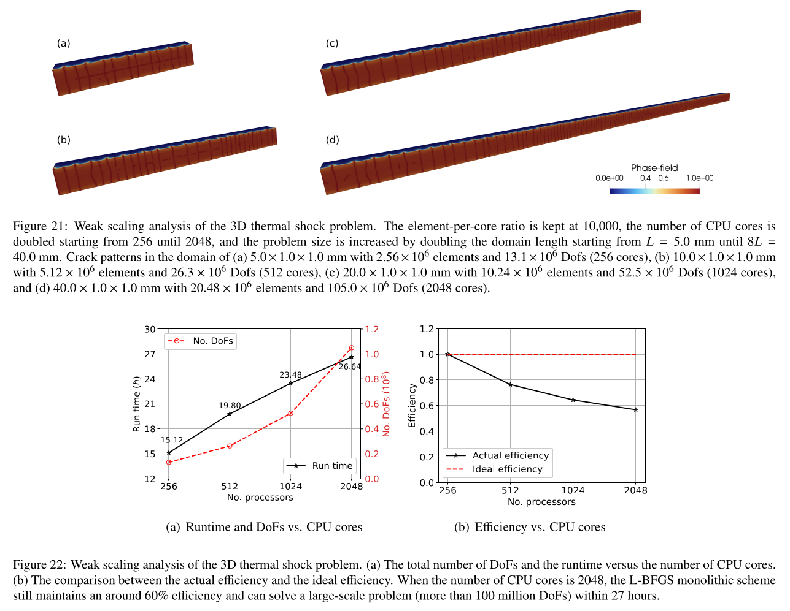
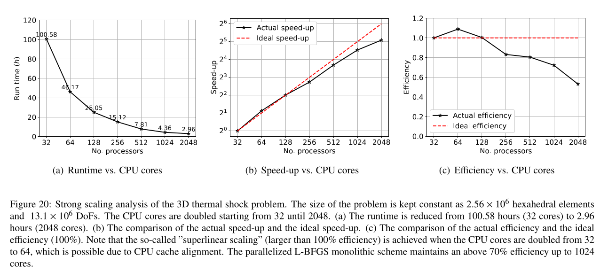

# Thermomechanical_phasefield_LBFGS_mpi

An MPI-enabled the L-BFGS monolithic solver for phasefield crack modeling under thermomechanically coupled loading. 


## Purpose

Phase-field fracture models are computationally expensive because they require extremely fine meshes to resolve the regularized crack topology.  
This project aims to improve the efficiency and scalability of a monolithic thermomechanical solver for large-scale thermomechanically coupled phase-field simulations on both single machines and High-Performance Computing (HPC) clusters.

The main features include:

- Configurable execution modes: selectable via a parameter (`.prm`) configuration file, supporting both serial execution and Message Passing Interface (MPI) parallelization with non-overlapping mesh decomposition over ranks.
- Adaptive mesh refinement (AMR) with optional repartitioning: in MPI mode, dynamic repartitioning can be conducted based on a user-defined imbalance threshold (ratio between the maximum and minimum number of cells per compute rank) to maintain load balance.
- Selectable linear algebra backends: the solver infrastructure supports both *PETSc* and *Trilinos* backends for distributed vectors, matrices, and solvers through a unified wrapper interface.
- Selectable linear solvers: the *sparse direct* or *iterative* solvers (e.g., Conjugate Gradient (CG)) can be selected for the linear algebra system.
- Quasi-Newton nonlinear solver: Serial and MPI-enabled monolithic limited-memory BFGS (L-BFGS) method for thermomechanically coupled phase-field fracture problems.
- History variable: quadrature-point history field storing the maximum positive strain energy to enforce irreversibility.
- Dimension-independent implementation: the code works for both 2D and 3D simulations.
- Various phase-field models, including AT-1, AT-2, AT-1 cohesive, and phase-field regularized cohesive-zone model (PFCZM), can be chosen.

### Representative results
Scaling analysis of a 3D thermal shock induced phase-field crack example, which is performed on the cluster [Nibi](https://docs.alliancecan.ca/wiki/Nibi) of Digital Research Alliance of Canada.

1. Weak scaling analysis by increasing the problem size and the CPU cores at the same time:
<p align="center">

</p>
2. Strong scaling analysis by keeping the problem size constant (2.56 million hexahedral elements and 13.1 million DoFs) and doubling the CPU cores:
<p align="center">

</p>

---


## How to Build

This project is implemented using the deal.II finite element library and supports both serial and MPI-enabled monolithic L-BFGS finite element simulations.

### Requirements

- developed with deal.II v9.6.0 (last verified: 2026-02-17)
- C++17 compatible compiler
- deal.II configured with:
  - MPI
  - Trilinos / PETSc
  - BLAS / LAPACK
  - TBB (Threading Building Blocks)
  - UMFPACK

### Build

An out-of-source CMake build is recommended.
Run the following commands in the root directory of this project:

```bash
cmake -S . -B build
cmake --build ./build 
```
The executable `main` will be generated inside the `build/` directory.

---

## How to run

### Parameter file

Execution requires a parameter file (`.prm`) that defines dimension, test case, solver type, tolerances, directories, and all run-time settings. 
The path to the `.prm` file must be provided as a command-line argument to the executable, such as: 

```bash
./build/main path/to/parameter.prm
```

---

### Execution modes

The MPI and serial modes can be selected in the `.prm` file. 
Two MPI backends are supported: PETSc and Trilinos.


#### Serial mode

For serial execution, set the following option in the `.prm` file:

```  
# underlying mpi type: (PETSc | Trilinos | Serial)
set mpi type = Serial
```

Execute:

```bash
./build/main path/to/parameter.prm
```

#### MPI mode

For MPI execution, set the backend to either `PETSc` or `Trilinos` in the `.prm` file, for example:

```  
# underlying mpi type: (PETSc | Trilinos | Serial)
set mpi type = PETSc
```

or

```  
set mpi type = Trilinos
```

1. Run on a single machine with MPI: 

- using `mpirun`:

```bash
mpirun -np <N> ./build/main path/to/parameter.prm
```


- using `mpiexec`:

```bash
mpiexec -n <N> ./build/main path/to/parameter.prm
```


2. Run on Slurm clusters:

On clusters, the parallel executions may require submission of a job via `.sh` script. 
If the executable will run on 32 ranks with 32 GB memory in 10 hours, the script can be an example:  

```bash
#!/bin/bash
#SBATCH --ntasks=32              # number of MPI processes
#SBATCH --mem-per-cpu=1G      # memory; default unit is megabytes
#SBATCH --time=0-10:00           # time (DD-HH:MM)

#SBATCH --mail-user=your.email@address.com
#SBATCH --mail-type=ALL

srun ./build/main path/to/parameter.prm          # mpirun or mpiexec also work
```

#### Mode mismatch between `.prm` configuration and command line

If the mode specified in the `.prm` file does not match the command line used to launch the executable, the program does not automatically detect or prevent this mismatch.
Once the executable starts, information about the MPI mode and output directory will be summarized and printed to the terminal or output file when running on clusters. 
The mismatch can be identified from this output. 

Examples of correct outputs are shown below: 

- Serial mode
 
```
Non-MPI mode

Dir:    ./path/to/output/dir
Type:   Serial
Log:    logfile_name
```

- MPI mode 

```
MPI mode
        number of ranks: 32     current rank: 0

Dir:    ./path/to/output/dir
Type:   Trilinos
Log:    logfile_name
```


---
### Configuration directory and data files

The monolithic thermomechanically coupled phase-field solver requires two data files:

- a time data file
- a material data file

Their file names (without directory path) are specified in the `.prm` file, which is passed as a command-line argument when launching the executable.


- Time data file name:

```
# Time data groups
set Time data file = timeDataFile
```

- Material data file name:

```
# Material data file name
set Material data file = materialDataFile
```


These data files should be placed in the directory specified by:

```
# Configuration directory
set Config dir = ./path/to/data/dir
```

The solver resolves the full path as: `<Config dir>/<file name>`.
All paths are interpreted with respect to the **working directory** from which the executable is launched. 
Moreover, the absolute dirctory is **not** allowed.
For example, if the executable is launched from the project root directory, `project_root`, then 
```set Config dir = ./path/to/config_dir```,
the directory path will be referred to
```<project_root>/path/to/config_dir/```.

---

### Output directory

The output directory can be defined in the `.prm` file, for example: 

```
# Output directory
set Output dir = ./path/to/output/dir
```

For each run, the executable automatically creates a unique numbered subdirectory to avoid overwriting previous results.
The actual output path has the form:

```
<Output dir>/<run_id>/
```

where `<run_id>` is an integer starting from **0**.  
It is assigned as one greater than the largest existing numeric subdirectory name in the output directory.


The output folder of each test contains:

- `.log`: solver log file
- `.vtu`: visualization files
  - original mesh:  
    ```
    <Output dir>/<run_id>/ori/
    ```
  - solution and field results:  
    ```
    <Output dir>/<run_id>/results/
    ```
- `.hist`: history data files (e.g., energy history and reaction force history):
    ```
    <Output dir>/<run_id>/hist/
    ```


---

### Adaptive repartitioning

Repartitioning is important in MPI computations because workload imbalance among ranks can reduce parallel efficiency. 
If one rank has a significantly lighter workload than the others, it may complete its local task earlier and then remain idle to wait for data from the slower ranks.

By default, deal.II automatically performs repartitioning after each call to `execute_coarsening_and_refinement()`. 
In phase-field fracture simulations, adaptive mesh refinement often requires several local refinement cycles around the evolving crack tip, while only a small portion of the mesh is actually refined. 
In such cases, frequent repartitioning for only a small number of newly refined elements may introduce unnecessary communication overhead.

To avoid this, adaptive repartitioning can be controlled by a threshold based on the ratio of the maximum to the minimum number of locally owned active cells across all ranks.

#### How to enable

1. **Compile the executable with repartitioning enabled**
   - **Before compilation**, make sure that the macro `ENABLE_REPARTITION=1` is set in `main.cc` to enable adaptive repartitioning functionality.
        - **Note:** Repartitioning requires that no active cell still has a refine flag. 
       In some versions of deal.II, these flags may not be fully cleared after `execute_coarsening_and_refinement()` or even after calling `cell->clear_refine_flag()` on each active cell, which may lead to a runtime exception. 
       This issue does not cause compilation errors, and it only appears at runtime. 
       If this happens, disable adaptive repartitioning by setting `ENABLE_REPARTITION=0` and recompile the executable.
   - Compile the executable by following the [build instructions](#how-to-build).

2. **Configure the runtime settings in the `.prm` file**
   - Turn on [MPI mode](#mpi-mode).
   - Enable adaptive refinement by setting `set Mesh refinement strategy = adaptive-refine`
   - Set the repartitioning threshold by `set Repartitioning ratio = prescribed threshold`
     - The default threshold is `2.0`.
     - Repartitioning will be performed after every refinement step if the threshold is equal to or smaller than `1.0`.

